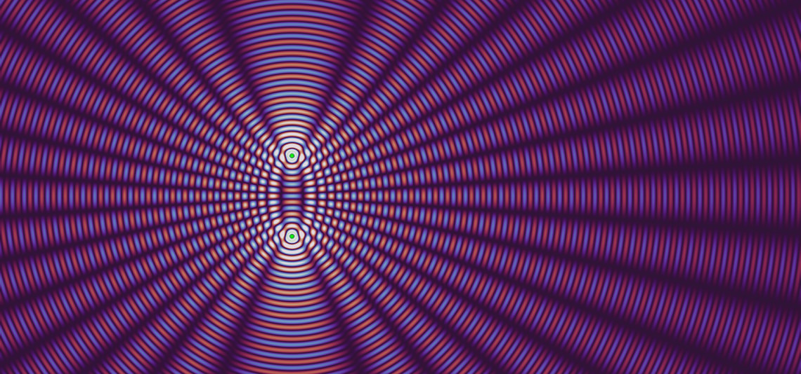

# Wave Optics Simulation
[](https://github.com/ssenhorst/ray-optics/actions/workflows/deploy.yml)
[](https://github.com/ssenhorst/ray-optics/actions/workflows/test.yml)

A web app for simulating 2D wave optics: light as a complex scalar field, summed from point sources,
so that diffraction, interference and the resolution limit come out of the simulation rather than
being drawn on top of it. It is built for teaching, and carries an assignment system that scores a
student's work against the field as they change the scene.

It is a fork of the [Ray Optics Simulation](https://github.com/ricktu288/ray-optics), whose ray
tracer and editor it still contains and still runs. See [CITATION.md](CITATION.md) for which project
to cite for which part, and [NOTICE](NOTICE) for what was inherited and what was changed.

## Features

- Light as a scalar field, propagated with the Rayleigh–Sommerfeld integral, so near field and far
  field are the same calculation
- Sources: point, line with an arbitrary complex profile, and plane wave
- Elements: refracting interfaces of any shape, glass lenses, multi-slit apertures, square and
  sinusoidal gratings, zone plates, and binary masks defined by an equation
- Media with a refractive index, entered and left through curved interfaces
- Measurements: a focus probe that finds and reports a focus, and a screen that plots the field
  falling on it
- Three views of the same field: intensity, the instantaneous real field, and amplitude with phase
  as hue
- Adaptive resolution, computed on the GPU, refining while you drag
- Worked examples that build themselves to fit the window they open in
- Assignments with goals scored live, packable into one self-contained HTML file
- Embeddable in Jupyter and MyST as an [anywidget](https://anywidget.dev)

The ray optics simulator this project was forked from is still here, at `/simulator/`, with
everything it could do before. Its own features are listed in
[its README](https://github.com/ricktu288/ray-optics#features).

## Task scenes

A scene can carry an `interaction` property saying what the user may change (scene-wide and per
object, down to individual properties), a `ui` property saying which parts of the interface are
shown, and a `task` property stating an assignment with goals that are scored after every
simulation run. Both simulators are supported: ray goals count where rays go, wave goals measure the
field. `npm run build-tasks` packs each scene in `data/taskScenes/` into a single
self-contained HTML file under `dist/tasks/`, suitable for embedding in a course platform that
allows only static HTML with no external dependencies. See
[data/taskScenes/README.md](data/taskScenes/README.md) for the authoring guide.

## Jupyter and MyST

The same applet is published as three [anywidget](https://anywidget.dev) classes, so a scene, a wave
optics scene or an assignment can be dropped into a notebook or a MyST Markdown document, which
passes the scene it wants to show:

```python
from ray_optics_widgets import RayOpticsWidget, WaveOpticsWidget, TaskWidget

WaveOpticsWidget("wave_zone_plate", height=520)
```

`npm run build-anywidget` builds the bundle; the Python package around it lives in
[python/](python/README.md) and is installed from this directory with `pip install .`. Each release
also publishes the bundle on its own, readable and minified, for a page that embeds the module
directly rather than through Python.

## Links
- [**Launch the Wave Optics Simulator**](https://ssenhorst.github.io/ray-optics/wave/)
- [Gallery and assignments](https://ssenhorst.github.io/ray-optics/gallery/)
- [Documentation](https://ssenhorst.github.io/ray-optics/docs/index.html)
- [The ray optics simulator](https://ssenhorst.github.io/ray-optics/simulator/)
- [Run Locally](https://github.com/ssenhorst/ray-optics/blob/master/run-locally/README.md)

## Cite this project

Which work to cite depends on which part you used: this project for the wave optics simulator and
the assignments, the original Ray Optics Simulation for the ray tracer. [CITATION.md](CITATION.md)
says how, and [CITATION.cff](CITATION.cff) holds the metadata that GitHub's "Cite this repository"
button and most reference managers read.

## Contributing

Contributions are welcome. For the following types of contributions, no (or little) programming knowledge is required:

- New items in the [gallery](https://ssenhorst.github.io/ray-optics/gallery/)
- New translations
- New modules (as in Tools -> Other -> Import Modules)

See [CONTRIBUTING.md](https://github.com/ssenhorst/ray-optics/blob/master/CONTRIBUTING.md) for the tutorial.

Translations of the inherited interface are managed by the upstream project on
[Weblate](https://hosted.weblate.org/engage/ray-optics-simulation/) and reach this fork when it
merges from upstream; contribute them there. Strings belonging to the wave optics simulator are only
in this repository, and are contributed here.

To contribute code, you need to have some knowledge of JavaScript and module bundling. The code is written in ES6 and bundled with Webpack. The code structure is documented in the [documentation](https://ssenhorst.github.io/ray-optics/docs/index.html). See the following section for installation instructions.

## Installation

> [!NOTE]
> The following instructions are for developers. If you just want to use the web app, you can launch it directly from [here](https://ssenhorst.github.io/ray-optics/wave/).
> If you just want to run the project locally, please see [Run Locally](https://github.com/ssenhorst/ray-optics/blob/master/run-locally/README.md).

To run the web app locally for development, you need to have Node.js installed. Then, run the following commands in the terminal:
```bash
git clone https://github.com/ssenhorst/ray-optics.git
cd ray-optics
npm install --no-optional
npm run start
```
After that, the wave optics web app should be running at `http://localhost:8080/wave/`, and the ray simulator at `http://localhost:8080/simulator/`. Note however that some links and the "import module" window will not work because the other part of the project is not built.

If you want to build the entire project, including the home pages, gallery, modules, documentation, and the node version of the simulator, you can run the following command:
```bash
npm install
npm run build
```
After that, the entire content for the [https://ssenhorst.github.io/ray-optics/](https://ssenhorst.github.io/ray-optics/) website will be in the `dist` folder. You can again run `npm run start` to run the simulator locally, and now all the links and the "import module" window should work.

If an error occurs during the installation, some common reasons are:
- The version of Node.js is too old. You can update Node.js to version 18 or later.
- Some system dependencies for node-canvas are missing. You can find the instructions for installing the dependencies in the [node-canvas repository](https://github.com/Automattic/node-canvas).

The full build may takes about half an hour to complete due to the generation of the large numbers of images for the gallery.

## Project structure

- `src` contains the source code for the project.
- `data` contains the data for gallery, modules, and the list of contributors.
- `locales` contains the translations for the project in i18next format, managed by Weblate.
- `scripts` contains the scripts for custom build steps.
- `test` contains the automatic tests for the project.
- `python` contains the Python distribution of the widgets, which wraps the built bundle as anywidgets. The project it belongs to is described by `pyproject.toml` at the root, so the repository as a whole is what `pip install .` installs.
- `integrations` contains the integration tools for the simulator with other programming languages.
- `dist` (generated at build time) contains the built files for the project (the entire content for the [https://ssenhorst.github.io/ray-optics](https://ssenhorst.github.io/ray-optics) website).
- `dist-node` (generated at build time) contains the built files for the node module version of the simulator, which is required for the image generation, and can also be used in your own project.
- `dist-integrations` (generated at build time) contains the built files for the integration tools.

See the README.md in each directory for more information.

## Development

For development of the web app, you can just use `npm run start`, and the web app will be automatically reloaded when some code for the simulator is modified. However, to rebuild some other part of this project, you need to run the following commands:
```bash
# build home pages, about pages, gallery, and modules pages (not including scenes and image generation).
npm run build-pages

# build the scenes for the gallery and modules pages.
npm run build-scenes

# build the node module version of the simulator, which is required for the image generation.
npm run build-node

# generate images for the gallery, which may take a long time.
npm run build-images

# build the web app version of simulator (unlike npm run start, this command builds the simulator in production mode)
npm run build-app

# build one self-contained page per scene in data/taskScenes, into dist/tasks.
npm run build-tasks

# build documentation
npm run build-docs
```
Note that `npm run build` is equivalent to running all the above commands.

Two further builds are not part of `npm run build`, since neither belongs in the website:
```bash
# build the anywidget bundle, into python/ray_optics_widgets/static.
npm run build-anywidget

# open a task scene in the app as a designer, rather than as an assignment.
npm run build-task-editor
```

The thumbnails the gallery shows for the wave-optics examples and assignments are screenshots of the
real app, so they need a browser and are not rebuilt on every build. The output is committed;
regenerate it with `npm i --no-save puppeteer && node ./scripts/buildWaveImages.mjs`, or one section
of it with `--only=tasks`.

## Testing

To run the automatic tests,
```bash
npm run test
```
The tests are run automatically when you commit your changes.

The above command will run the following tests:
```bash
npm run test:propertyUtils
npm run test:sceneObjs
npm run test:scenes
```
the first one is unit tests for `src/core/propertyUtils` (formula parsing, key paths, equation conversion, and parametrization helpers).
the second one tests the user creation, dragging, and changing properties for each scene object in the source code.
the third one runs the scene JSONs in `test/scenes/` with the node module version of the simulator, and compares the output of `CropBox`/`Detector` with the corresponding PNG/CSV files.

If you modify the appearance of some objects or rays, the images in `test/scenes/` may need to be updated. Also if you add new scene tests, the corresponding PNG and CSV files nees to be initialized. In these cases, run the following command to regenerate all the PNG/CSV files after you make sure that all the failing tests are due to the changes you made:
```bash
env WRITE_OUTPUT=true npm run test:scenes
```
Please do not run this command if you are not sure that all the failing tests are due to the changes you made, since after running it, all scene tests will pass vacuously.

Currently there is no automatic end-to-end test for the web app. So please manually check that the UI works as expected if you make any changes.

## Use as a Node Module

The simulator can be used as a node module in your own project and integrated with other programming languages.
The easiest way is to use the built [integration tools](https://github.com/ssenhorst/ray-optics/tree/dist-integrations). You don't need to clone this repo and build anything, but you still need to have Node.js installed.

For more advanced usage, the node module version of the simulator is built with the following command:
```bash
npm run build-node
```
After that, you can use the simulator in your own project by importing the module:
```javascript
const { Scene, Simulator, sceneObjs, geometry } = require('path/to/ray-optics/dist-node/rayOptics.js');
```

See the [documentation](https://ssenhorst.github.io/ray-optics/docs/index.html) for more information about the API. For a usage example, see the [image generation script](https://github.com/ssenhorst/ray-optics/blob/master/scripts/buildImages.mjs).

To build the integration tools by yourself, run the following command:
```bash
npm run build-integrations
```

## License

```
Copyright 2016–2026 The Ray Optics Simulation authors and contributors

Licensed under the Apache License, Version 2.0 (the "License");
you may not use this file except in compliance with the License.
You may obtain a copy of the License at

    http://www.apache.org/licenses/LICENSE-2.0

Unless required by applicable law or agreed to in writing, software
distributed under the License is distributed on an "AS IS" BASIS,
WITHOUT WARRANTIES OR CONDITIONS OF ANY KIND, either express or implied.
See the License for the specific language governing permissions and
limitations under the License.
```
